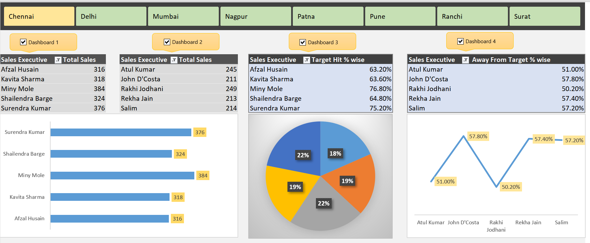

<p align="center">
  
</p>

# 📊 Sales Interactive Dashboard | Data Analytics Project


---

## 📌 Project Overview
This project features a comprehensive **Sales Interactive Dashboard** developed using Advanced Microsoft Excel. The primary objective is to transform raw, fragmented sales data into a streamlined visual report that empowers stakeholders to monitor business health, identify growth opportunities, and make data-driven decisions.

The goal of this project is to demonstrate practical skills in **data analysis, dashboard design, and business intelligence reporting**.

---

## 📊 Key Dashboard Features

- ✔ Interactive filters and slicers  
- ✔ Sales trend analysis over time  
- ✔ Product and category performance insights  
- ✔ Regional sales comparison  
- ✔ Dynamic charts and visualizations  
- ✔ Clear KPI indicators for quick analysis

These features allow users to explore the dataset from multiple perspectives and quickly identify important business insights.

---

## 🛠 Tools & Technologies Used

- Microsoft Excel 
- Data Cleaning & Data Preparation
- Data Visualization Techniques
- Business Intelligence Concepts
- Interactive Dashboard Design

---

## 📁 Project Structure

```text
├── Screenshots/                                      # Visual previews of the dashboard
├── sales-interactive-dashboard-excel-project.xlsm    # Main Excel file containing the 
|                                                        Interactive Dashboard
└── README.md                                         # Project documentation

```

---

## 📈 Insights Generated From the Dashboard

Using this dashboard, users can easily analyze:

- Total sales performance
- Sales growth trends over time
- Top-selling products
- Regional sales distribution
- Category contribution to total revenue

These insights help businesses identify opportunities for growth and improve strategic decision-making.

---

## ▶ How to Use This Project

1.  **Step 1: Clone the Repository**
    ```bash
    git clone [https://github.com/Alamin-refat/Sales-interactive-dashboard-project-1.git](https://github.com/Alamin-refat/Sales-interactive-dashboard-project-1.git)
    ```
2.  **Step 2:** Open the dashboard file in **Microsoft Excel**.
3.  **Step 3:** Use **Slicers (Filters)** and interactive visuals to explore the data dynamically.

---

## 💡 Skills Demonstrated
This project highlights the following core competencies:

* **Data Analysis:** Transforming raw data into structured insights.
* **Data Visualization:** Creating impactful charts and graphs.
* **Dashboard Development:** Building user-friendly reporting interfaces.
* **Business Intelligence:** Aligning data with business KPIs.
* **Data Storytelling:** Communicating complex trends simply.
* **Analytical Thinking:** Problem-solving through data patterns.

---

## 🔮 Future Improvements
* Integrate **SQL Database** as a live data source.
* Add **Automated Data Refresh** pipelines.
* Deploy the dashboard online using **Excel Services** or **Power BI Service**.
* Expand analysis with additional demographic datasets.
* Build advanced **KPI Tracking** features for automated alerting.

---

## 👨‍💻 Author

### **Alamin Refat**
*Aspiring Data Analyst | Data Science Enthusiast*

I am passionate about transforming raw data into actionable insights using modern data analytics and visualization techniques.

[](https://www.linkedin.com/in/alaminrefat/)
[](https://github.com/Alamin-refat)
[](mailto:alaminrefat2017@gmail.com)

---

## ⭐ Support
If you found this project useful, please consider giving the repository a **Star**! It helps the project gain visibility and motivates further development.

---

## 📜 License

This project is licensed under the **MIT License**.

You are free to use, modify, and distribute this project for personal or commercial purposes, provided that proper credit is given to the original author.

See the LICENSE file for more details.